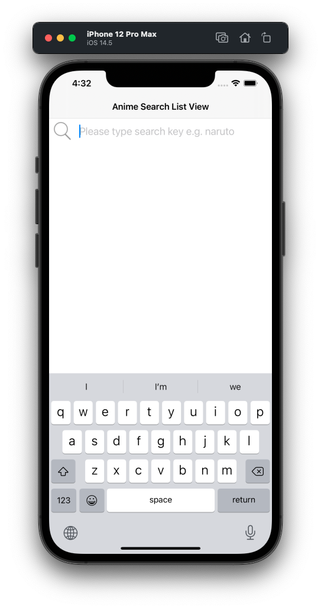
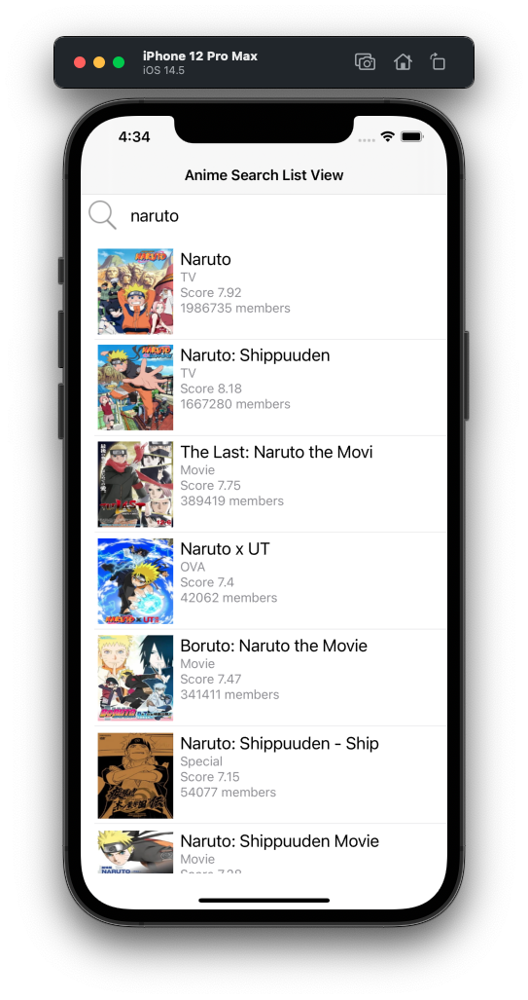
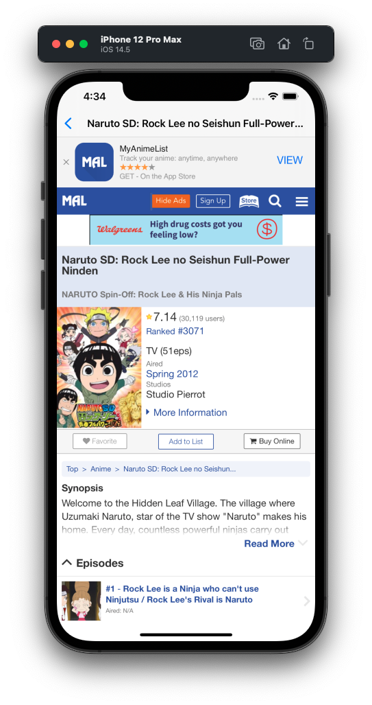

# jikanmoe

## View

## Implementation
- Design and implementation has an MVVM Model with SwiftUI and Combine.
- Connect to API of https://api.jikan.moe/v3/search/anime?q=naruto
- Using SwiftUI for user interface and the update data with observed object.
- Using UIViewRepresentable for connect to WKWebView of UIKit. (for Anime detail view)

### View
- <b>SearchListView.swift</b> - 
Anime Search and Display Search Result Anime List
- <b>AnimeDetailView.swift</b> - 
Anime Detail View 
- <b>AnimeWebView.swift</b> - 
Interface and connect to WKWebView on UIKit and has a delegate for WKWebView.
- <b>URLImage.swift</b> - 
Implement URLImage for Display the Download Images

### ViewModel
- <b>SearchListViewModel.swift</b> -
Manage and connect to SearchListView and download data with API 
- <b>ImageDownloader.swift</b> -
Download Image and Update to UI 

### Model
- <b>AnimeSearchResponse.swift</b> -
Anime Download Data Model from API

### jikan.more API Connector
- <b>SearchAnimeAPI.swift</b> -
Connect to API and Fetch data with Combine publisher

### Helpers
- <b>ConstantsTable.swift</b> -
Define constants table
